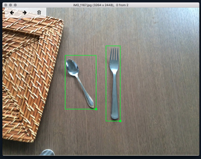

# Mac Application for fast image labeling.


This repository contains the code for the Mac Application for labeling images. Result of labeling is stored in simple json format. Which can be further processed, there is generate_data.py script provided.




## Installation

XCode is required. Open Project in XCode and run it. Application should be very easy to use, there is [tutorial](/Mac\ App/ImageLabeling/welcome_text.md) too.


## Generating data after json was created

After labeling images, there should be `images_info.json` in the directory with images.

format is as follows:

```
{
  "img.png" : {
    "frames" : [
      {
        "y" : 100,
        "x" : 120,
        "width" : 100,
        "height" : 100
      },
      {
        "y" : 200,
        "x" : 200,
        "width" : 100,
        "height" : 100
      }
    ]
  }, ....
}
```


To run provided `generate_data.py` script requires installed PIL. Its best to have virtual environments installed first [virtual environments](http://docs.python-guide.org/en/latest/dev/virtualenvs/#virtualenvironments-ref). 
	
    pip install PIL


To run script you can use:

    python generate_data.py ~/path/to/images --width 100 --height 100


Script code should be easy to modify and decide how many background images to generate, which regions of images discard etc.


